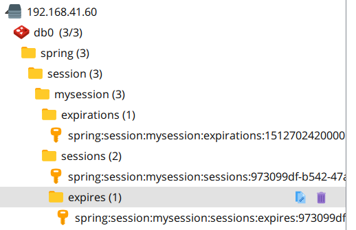

# 使用Spring boot基于Redis快速搭建分布式Session缓存方案


大型web应用中,session的管理非常重要,这是单机存储满足不了的.

通常有以下几种方法:

1. 将session持久化到数据库中. 但缺点是读写成本太高.

2. 去session化,比如将信息存储到cookie中. 但缺点是大小有限制,并且不安全.

3 . 将session存储到一个分布式的nosql数据库中,比如 Redis.

接下来就介绍一下 在SpringBoot应用中如何快速搭建一个基于Redis的分布式session存储方案


## 第一步:搭建Spring Boot开发环境

添加maven核心依赖 spring-session-data-redis 

```xml
<!--基于redis的分布式session存储-->
		<dependency>
			<groupId>org.springframework.session</groupId>
			<artifactId>spring-session-data-redis</artifactId>
		</dependency>
```

在application.properties文件中配置redis连接属性

```properties

######   Redis config start ######
spring.redis.database=0
spring.redis.host=192.168.41.60
spring.redis.port=6379
spring.redis.password=
spring.redis.pool.max-active=20
spring.redis.pool.max-wait=-1
spring.redis.pool.max-idle=8
spring.redis.pool.min-idle=0
spring.redis.timeout=0
######   Redis config end ######
```

## 第二步:开启 @EnableRedisHttpSession 注解

```java
@Configuration
@EnableRedisHttpSession(redisNamespace = "mysession",maxInactiveIntervalInSeconds = 60*60*24)
public class SessionConfig {
}
```
**@EnableRedisHttpSession注解的源码如下,可以看到可以配置三个参数:**

* maxInactiveIntervalInSeconds :session中的数据的过期时间(不是session在redis中的过期时间)
* redisNamespace :命名空间,可以配置当前应用的名称,我这里配置了 mysession.
* redisFlushMode :redis保存session的方式,默认 ON_SAVE
    有两种方式: **IMMEDIATE**:一旦创建session的时候就立即保存. **ON_SAVE**:创建session的时候不会保存,但当往session中添加数据的时候就会保存

```java
@Retention(java.lang.annotation.RetentionPolicy.RUNTIME)
@Target({ java.lang.annotation.ElementType.TYPE })
@Documented
@Import(RedisHttpSessionConfiguration.class)
@Configuration
public @interface EnableRedisHttpSession {
	int maxInactiveIntervalInSeconds() default 1800;

	String redisNamespace() default "";

	RedisFlushMode redisFlushMode() default RedisFlushMode.ON_SAVE;
}

```


## 第三步:测试

编写一个controller
```java
@RestController
public class HelloController {

    @RequestMapping("/hello/{username}")
    public String hello(HttpSession session, @PathVariable(value = "username") String username) {
        session.setAttribute("username", username);
        return "保存session到Redis成功";
    }

    @RequestMapping("/getName")
    public String getUsername(HttpSession session) {
        String username = (String) session.getAttribute("username");
        return username;
    }

}
```

当浏览器访问 http://localhost:8080/hello/admin 这个链接,

hello方法会接受到 浏览器传过来的参数,并保存在session中,然后再把session保存到Redis中

通过查看redis中的信息可看到如下信息:



其中 spring:session 是自动添加的,我们创建的命名空间 mysession 在这个默认的目录下面 


接下来我们再访问 http://localhost:8080/getName ,便可以看到浏览器会显示 刚才我们保存再session中的 admin

## 小结:

上面结合示例代码介绍了数据缓存，共享Session两个Redis的典型应用场景.

除此之外，还有分布式锁，全局计数器等高级应用场景，以后在其他文章中再详细介绍.


